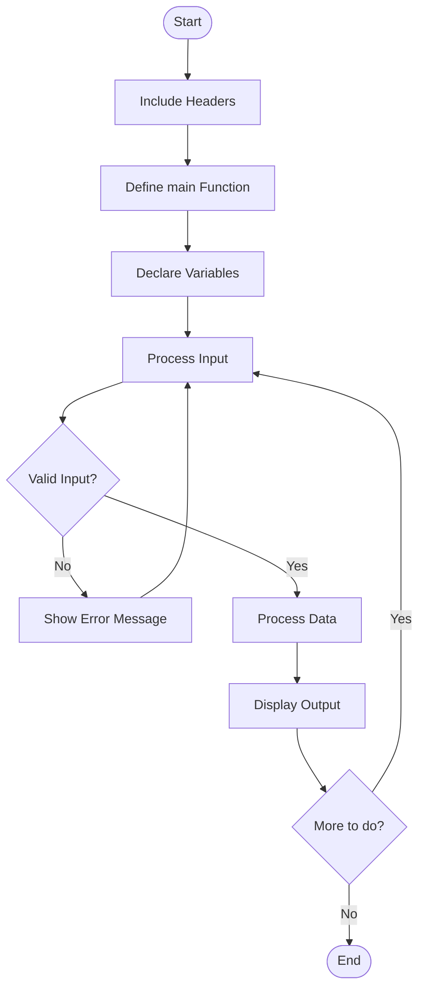
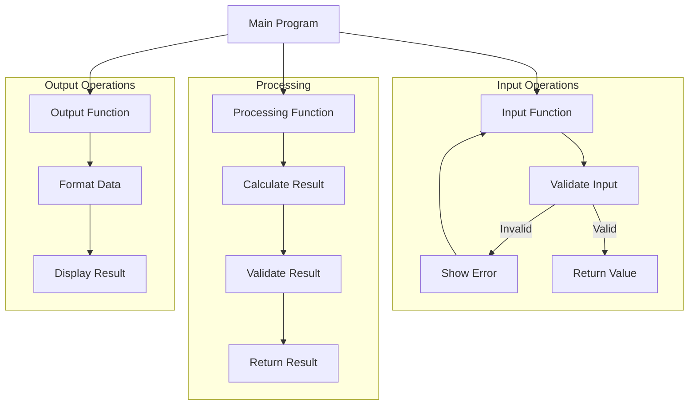
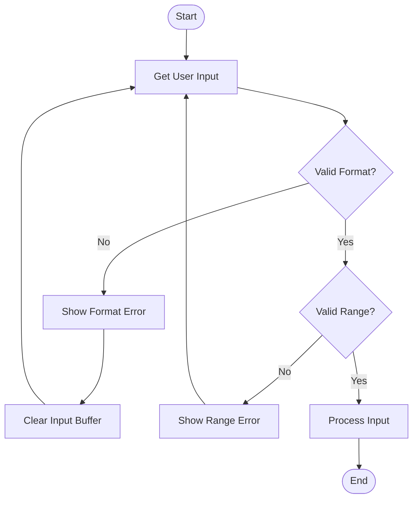
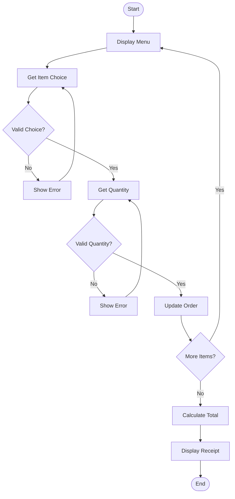
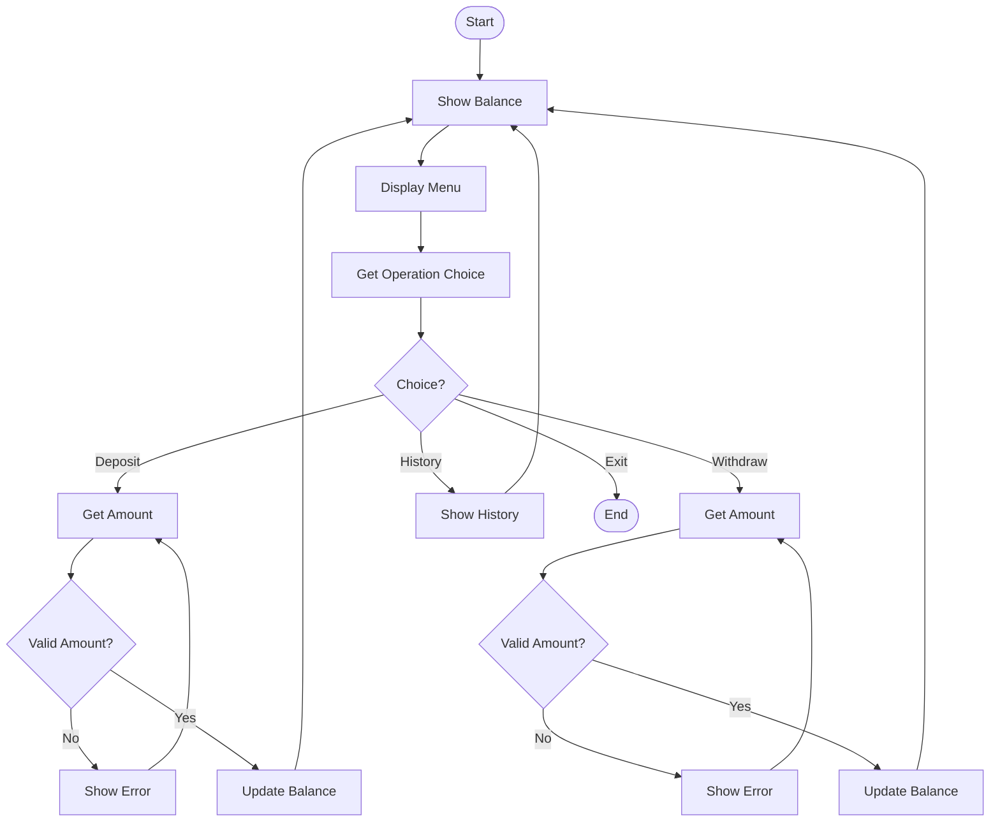
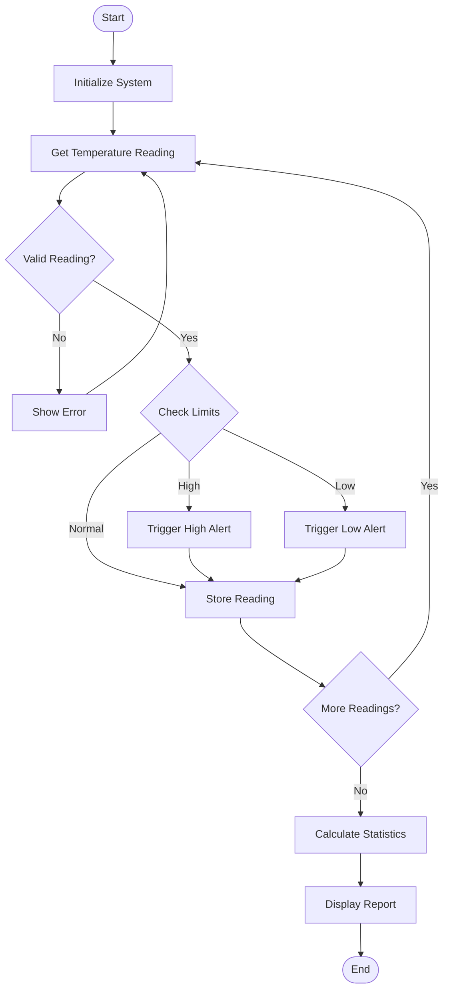
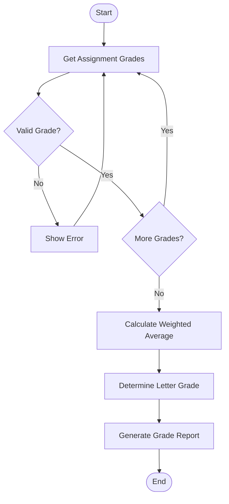

# Part 5: Basic Programs

Think of a program like a recipe - it's a set of instructions that tells the computer exactly what to do, step by step. Just as a recipe has ingredients (variables), instructions (statements), and produces a final dish (output), a program combines the concepts we've learned to create something useful.

## Program Structure

### Program Flow Visualization


### Real-world Analogy
Think of a program's structure like organizing a restaurant:
- Header files (#include) are like getting your ingredients and tools ready
- The main() function is like the kitchen where everything happens
- Variables are like your ingredients
- Statements are like the cooking steps
- Return value is like the final quality check

### Basic Structure
```cpp
// Get our tools ready
#include <iostream>
#include <iomanip>

// This is where our program starts
int main() {
    // Declare variables (prepare ingredients)
    // Write statements (follow recipe steps)
    // Return success/failure status
    return 0;
}
```

### Common Mistakes
- Forgetting to include necessary headers
- Missing return statement in main()
- Not initializing variables before use

## Functions

### Function Flow Visualization


### Real-world Analogy
Think of functions like different stations in a kitchen:
- Each station has a specific task (function)
- They take ingredients (parameters)
- They produce a result (return value)
- They can work independently (modular)

### Function Example
```cpp
// Calculate total cost including tax
double calculateTotal(double price, int quantity, double taxRate) {
    double subtotal = price * quantity;
    double tax = subtotal * taxRate;
    return subtotal + tax;
}

// Format currency for display
std::string formatCurrency(double amount) {
    std::stringstream ss;
    ss << std::fixed << std::setprecision(2) << "$" << amount;
    return ss.str();
}

int main() {
    double itemPrice = 9.99;
    int quantity = 3;
    double taxRate = 0.08;  // 8% tax
    
    double total = calculateTotal(itemPrice, quantity, taxRate);
    std::cout << "Total cost: " << formatCurrency(total) << "\n";
    
    return 0;
}
```

## Error Handling

### Error Handling Flow


### Real-world Analogy
Think of error handling like dealing with problems in a restaurant:
- Input validation is like checking if an order is valid
- Error messages are like explaining problems to customers
- Recovery steps are like fixing mistakes in orders

### Input Validation Example
```cpp
#include <iostream>
#include <limits>

int getValidQuantity() {
    int quantity;
    bool validInput = false;
    
    do {
        std::cout << "Enter quantity (1-100): ";
        
        if (std::cin >> quantity) {
            if (quantity >= 1 && quantity <= 100) {
                validInput = true;
            } else {
                std::cout << "Error: Quantity must be between 1 and 100.\n";
            }
        } else {
            std::cout << "Error: Please enter a valid number.\n";
            std::cin.clear();
            std::cin.ignore(std::numeric_limits<std::streamsize>::max(), '\n');
        }
    } while (!validInput);
    
    return quantity;
}
```

## Practice Exercises

### Restaurant Order System Flow


### Bank Account Manager Flow


### Temperature Monitoring Flow


### Grade Calculator Flow


1. Restaurant Order System
   - Take customer orders with validation
   - Calculate total with tax and discounts
   - Display formatted receipt
   - Handle multiple orders

2. Bank Account Manager
   - Check balance
   - Make deposits and withdrawals
   - Validate transactions
   - Display transaction history

3. Temperature Monitoring System
   - Record temperatures over time
   - Calculate average, high, and low
   - Alert for extreme temperatures
   - Display temperature trends

4. Student Grade Calculator
   - Input multiple grades
   - Calculate weighted averages
   - Generate grade reports
   - Validate input grades

### Tips for Success
- Plan your program structure before coding
- Test with different input values
- Handle invalid input gracefully
- Use functions to organize code
- Add helpful user prompts
- Format output for readability

## Next Steps
Move on to [Part 6: Problem Solving]({{ site.baseurl }}/tutorials/module1/part6-problem-solving) to learn how to approach and solve programming problems systematically.
