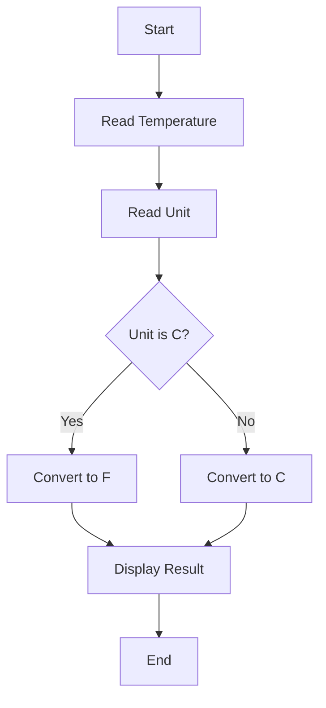

# Part 6: Problem Solving in C++

## Learning Objectives
- Understand systematic problem-solving approaches
- Learn to break down complex problems
- Practice solving programming challenges
- Develop debugging strategies

## Problem-Solving Process

### 1. Understanding the Problem
- Read the problem statement carefully
- Identify inputs and expected outputs
- List constraints and edge cases
- Example:
  ```cpp
  // Problem: Calculate the average of numbers in an array
  // Input: Array of integers [1, 2, 3, 4, 5]
  // Output: Average (3.0)
  // Constraints: Array not empty, handle integer overflow
  ```

### 2. Planning the Solution
- Break down into smaller steps
- Draw flowcharts or pseudocode
- Consider different approaches

#### Example Pseudocode
```
1. Calculate sum of all numbers
2. Count total numbers
3. Divide sum by count
4. Handle decimal precision
```

#### Flowchart Examples


```mermaid
flowchart TD
    A[Start] --> B[Initialize Array]
    B --> C[Set Left = 0]
    C --> D[Set Right = Length - 1]
    D --> E{Left < Right}
    E -->|Yes| F{Array[Left] + Array[Right] = Target}
    F -->|Yes| G[Return True]
    F -->|No| H{Array[Left] + Array[Right] < Target}
    H -->|Yes| I[Left++]
    H -->|No| J[Right--]
    I --> E
    J --> E
    E -->|No| K[Return False]
    G --> L[End]
    K --> L
```

```mermaid
flowchart TD
    A[Start] --> B[Read N]
    B --> C[Initialize memo array]
    C --> D[Call fibonacci(N)]
    D --> E{N <= 1}
    E -->|Yes| F[Return N]
    E -->|No| G{memo[N] != -1}
    G -->|Yes| H[Return memo[N]]
    G -->|No| I[Calculate fibonacci(N-1) + fibonacci(N-2)]
    I --> J[Store in memo[N]]
    J --> K[Return memo[N]]
    F --> L[End]
    H --> L
    K --> L
```

### 3. Implementation Examples

#### Example 1: Temperature Converter
```cpp
#include <iostream>

double celsiusToFahrenheit(double celsius) {
    return (celsius * 9/5) + 32;
}

double fahrenheitToCelsius(double fahrenheit) {
    return (fahrenheit - 32) * 5/9;
}

int main() {
    double temp;
    char unit;
    
    std::cout << "Enter temperature: ";
    std::cin >> temp;
    std::cout << "Enter unit (C/F): ";
    std::cin >> unit;
    
    if (unit == 'C' || unit == 'c') {
        std::cout << temp << "°C = " 
                 << celsiusToFahrenheit(temp) << "°F\n";
    } else if (unit == 'F' || unit == 'f') {
        std::cout << temp << "°F = " 
                 << fahrenheitToCelsius(temp) << "°C\n";
    }
    
    return 0;
}
```

#### Example 2: Finding Prime Numbers
```cpp
#include <iostream>
#include <vector>

bool isPrime(int number) {
    if (number <= 1) return false;
    for (int i = 2; i * i <= number; i++) {
        if (number % i == 0) return false;
    }
    return true;
}

std::vector<int> findPrimesUpTo(int limit) {
    std::vector<int> primes;
    for (int i = 2; i <= limit; i++) {
        if (isPrime(i)) {
            primes.push_back(i);
        }
    }
    return primes;
}

int main() {
    int limit;
    std::cout << "Find primes up to: ";
    std::cin >> limit;
    
    std::vector<int> primes = findPrimesUpTo(limit);
    
    std::cout << "Prime numbers up to " << limit << ":\n";
    for (int prime : primes) {
        std::cout << prime << " ";
    }
    std::cout << "\n";
    
    return 0;
}
```

#### Example 3: String Manipulation
```cpp
#include <iostream>
#include <string>
#include <algorithm>

std::string reverseWords(const std::string& sentence) {
    std::string result = sentence;
    std::reverse(result.begin(), result.end());
    
    size_t start = 0;
    size_t end;
    
    while ((end = result.find(" ", start)) != std::string::npos) {
        std::reverse(result.begin() + start, result.begin() + end);
        start = end + 1;
    }
    
    std::reverse(result.begin() + start, result.end());
    return result;
}

int main() {
    std::string sentence;
    std::cout << "Enter a sentence: ";
    std::getline(std::cin, sentence);
    
    std::string reversed = reverseWords(sentence);
    std::cout << "Reversed words: " << reversed << "\n";
    
    return 0;
}
```

### 4. Testing and Debugging Strategies

#### Systematic Testing
- Test with normal cases
- Test edge cases
- Test boundary conditions
- Example:
  ```cpp
  void testTemperatureConverter() {
      // Normal cases
      assert(celsiusToFahrenheit(0) == 32);
      assert(celsiusToFahrenheit(100) == 212);
      
      // Edge cases
      assert(celsiusToFahrenheit(-273.15) == -459.67);
      
      // Boundary cases
      assert(fahrenheitToCelsius(32) == 0);
  }
  ```

#### Debugging Tips
1. Use print statements strategically
   ```cpp
   std::cout << "Debug: value = " << value << "\n";
   ```

2. Break down complex expressions
   ```cpp
   // Instead of
   result = a * b + c / (d - e);
   
   // Use
   int temp1 = d - e;
   int temp2 = c / temp1;
   int temp3 = a * b;
   result = temp3 + temp2;
   ```

3. Use a debugger
   - Set breakpoints
   - Watch variables
   - Step through code

### 5. Common Problem-Solving Patterns

#### Pattern 1: Divide and Conquer
```cpp
// Binary Search implementation
int binarySearch(std::vector<int>& arr, int target) {
    int left = 0;
    int right = arr.size() - 1;
    
    while (left <= right) {
        int mid = left + (right - left) / 2;
        
        if (arr[mid] == target) return mid;
        if (arr[mid] < target) left = mid + 1;
        else right = mid - 1;
    }
    
    return -1;
}

// Merge Sort implementation
void merge(std::vector<int>& arr, int left, int mid, int right) {
    std::vector<int> temp(right - left + 1);
    int i = left, j = mid + 1, k = 0;
    
    while (i <= mid && j <= right) {
        if (arr[i] <= arr[j]) temp[k++] = arr[i++];
        else temp[k++] = arr[j++];
    }
    
    while (i <= mid) temp[k++] = arr[i++];
    while (j <= right) temp[k++] = arr[j++];
    
    for (i = 0; i < k; i++) {
        arr[left + i] = temp[i];
    }
}

void mergeSort(std::vector<int>& arr, int left, int right) {
    if (left < right) {
        int mid = left + (right - left) / 2;
        mergeSort(arr, left, mid);
        mergeSort(arr, mid + 1, right);
        merge(arr, left, mid, right);
    }
}
```

#### Pattern 2: Dynamic Programming
```cpp
// Fibonacci with memoization
int fibonacci(int n, std::vector<int>& memo) {
    if (n <= 1) return n;
    if (memo[n] != -1) return memo[n];
    
    memo[n] = fibonacci(n-1, memo) + fibonacci(n-2, memo);
    return memo[n];
}

// Example usage
int getFibonacci(int n) {
    std::vector<int> memo(n + 1, -1);
    return fibonacci(n, memo);
}

// Bottom-up approach for coin change problem
int coinChange(std::vector<int>& coins, int amount) {
    std::vector<int> dp(amount + 1, amount + 1);
    dp[0] = 0;
    
    for (int i = 1; i <= amount; i++) {
        for (int coin : coins) {
            if (coin <= i) {
                dp[i] = std::min(dp[i], dp[i - coin] + 1);
            }
        }
    }
    
    return dp[amount] > amount ? -1 : dp[amount];
}
```

#### Pattern 3: Two-Pointer Technique
```cpp
bool hasPairSum(std::vector<int>& numbers, int target) {
    int left = 0;
    int right = numbers.size() - 1;
    
    while (left < right) {
        int sum = numbers[left] + numbers[right];
        if (sum == target) return true;
        if (sum < target) left++;
        else right--;
    }
    return false;
}
```

#### Pattern 4: Sliding Window
```cpp
int maxSubArraySum(std::vector<int>& arr, int k) {
    int maxSum = 0;
    int windowSum = 0;
    
    // First window
    for (int i = 0; i < k; i++) {
        windowSum += arr[i];
    }
    maxSum = windowSum;
    
    // Slide window
    for (int i = k; i < arr.size(); i++) {
        windowSum = windowSum - arr[i-k] + arr[i];
        maxSum = std::max(maxSum, windowSum);
    }
    
    return maxSum;
}
```

#### Pattern 5: Backtracking
```cpp
// N-Queens Problem
bool isSafe(std::vector<std::vector<int>>& board, int row, int col, int N) {
    // Check row on left side
    for (int j = 0; j < col; j++)
        if (board[row][j]) return false;
    
    // Check upper diagonal on left side
    for (int i = row, j = col; i >= 0 && j >= 0; i--, j--)
        if (board[i][j]) return false;
    
    // Check lower diagonal on left side
    for (int i = row, j = col; j >= 0 && i < N; i++, j--)
        if (board[i][j]) return false;
    
    return true;
}

bool solveNQueens(std::vector<std::vector<int>>& board, int col, int N) {
    if (col >= N) return true;
    
    for (int i = 0; i < N; i++) {
        if (isSafe(board, i, col, N)) {
            board[i][col] = 1;
            
            if (solveNQueens(board, col + 1, N))
                return true;
            
            board[i][col] = 0; // Backtrack
        }
    }
    
    return false;
}
```

## Real-World Problem Examples

### 1. File Processing System
```cpp
class LogAnalyzer {
public:
    struct LogEntry {
        std::string timestamp;
        std::string level;
        std::string message;
    };
    
    std::vector<LogEntry> parseLogFile(const std::string& filename) {
        std::vector<LogEntry> entries;
        std::ifstream file(filename);
        std::string line;
        
        while (std::getline(file, line)) {
            LogEntry entry = parseLine(line);
            entries.push_back(entry);
        }
        
        return entries;
    }
    
    std::vector<LogEntry> filterByLevel(const std::vector<LogEntry>& logs, 
                                      const std::string& level) {
        std::vector<LogEntry> filtered;
        std::copy_if(logs.begin(), logs.end(), 
                    std::back_inserter(filtered),
                    [&level](const LogEntry& entry) {
                        return entry.level == level;
                    });
        return filtered;
    }
    
private:
    LogEntry parseLine(const std::string& line) {
        // Implementation of line parsing
        // Returns LogEntry struct
    }
};
```

### 2. Data Analysis System
```cpp
class DataAnalyzer {
public:
    struct DataPoint {
        double value;
        std::string category;
    };
    
    double calculateMean(const std::vector<double>& data) {
        if (data.empty()) return 0.0;
        return std::accumulate(data.begin(), data.end(), 0.0) / data.size();
    }
    
    double calculateStdDev(const std::vector<double>& data) {
        double mean = calculateMean(data);
        double sum = 0.0;
        
        for (double value : data) {
            sum += std::pow(value - mean, 2);
        }
        
        return std::sqrt(sum / data.size());
    }
    
    std::map<std::string, int> categorizeData(
        const std::vector<DataPoint>& data) {
        std::map<std::string, int> categories;
        for (const auto& point : data) {
            categories[point.category]++;
        }
        return categories;
    }
};
```

## Practice Exercises

### 1. Number System Converter
   - Convert between binary, decimal, and hexadecimal
   - Handle input validation
   - Format output properly

### 2. Advanced Text Analyzer
```cpp
class TextAnalyzer {
public:
    struct TextStats {
        int wordCount;
        int sentenceCount;
        int paragraphCount;
        double avgWordLength;
        std::map<std::string, int> wordFrequency;
    };
    
    TextStats analyze(const std::string& text) {
        TextStats stats;
        stats.wordCount = countWords(text);
        stats.sentenceCount = countSentences(text);
        stats.paragraphCount = countParagraphs(text);
        stats.avgWordLength = calculateAvgWordLength(text);
        stats.wordFrequency = getWordFrequency(text);
        return stats;
    }
    
private:
    int countWords(const std::string& text);
    int countSentences(const std::string& text);
    int countParagraphs(const std::string& text);
    double calculateAvgWordLength(const std::string& text);
    std::map<std::string, int> getWordFrequency(const std::string& text);
};
```

### 3. Expression Evaluator
```cpp
class Calculator {
public:
    // Evaluates mathematical expressions
    double evaluate(const std::string& expression) {
        std::stack<double> values;
        std::stack<char> operators;
        
        for (size_t i = 0; i < expression.length(); i++) {
            if (isdigit(expression[i])) {
                double value = 0;
                while (i < expression.length() && 
                       (isdigit(expression[i]) || expression[i] == '.')) {
                    value = value * 10 + (expression[i] - '0');
                    i++;
                }
                i--;
                values.push(value);
            }
            else if (expression[i] == '(') {
                operators.push(expression[i]);
            }
            else if (expression[i] == ')') {
                while (!operators.empty() && operators.top() != '(') {
                    double val2 = values.top(); values.pop();
                    double val1 = values.top(); values.pop();
                    char op = operators.top(); operators.pop();
                    values.push(applyOperator(val1, val2, op));
                }
                operators.pop(); // Remove '('
            }
            else if (isOperator(expression[i])) {
                while (!operators.empty() && precedence(operators.top()) 
                       >= precedence(expression[i])) {
                    double val2 = values.top(); values.pop();
                    double val1 = values.top(); values.pop();
                    char op = operators.top(); operators.pop();
                    values.push(applyOperator(val1, val2, op));
                }
                operators.push(expression[i]);
            }
        }
        
        while (!operators.empty()) {
            double val2 = values.top(); values.pop();
            double val1 = values.top(); values.pop();
            char op = operators.top(); operators.pop();
            values.push(applyOperator(val1, val2, op));
        }
        
        return values.top();
    }
    
private:
    bool isOperator(char c);
    int precedence(char op);
    double applyOperator(double a, double b, char op);
};
```

### 4. Data Structure Implementation
- Implement a custom linked list
- Create a binary search tree
- Design a hash table

### 5. Algorithm Challenges
- Implement path finding algorithms
- Create sorting algorithms
- Solve graph problems

## Next Steps
Continue to [Module 2: Control Flow]({{ site.baseurl }}/tutorials/module2) to learn about decision-making and loops in C++.
