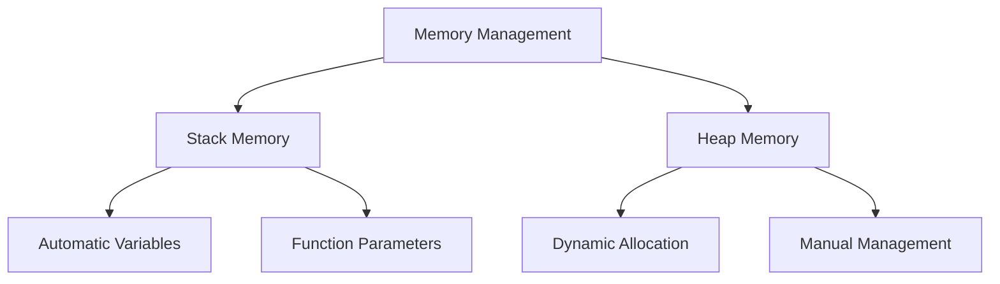

# Module 9: Pointers and Dynamic Memory

## Overview
This module explores pointers and dynamic memory management in C++. You'll learn about memory addresses, pointer operations, dynamic allocation, and memory management best practices.

## Parts

### [Part 1: Introduction to Pointers]({{ site.baseurl }}/tutorials/module9/part1-intro)
- Understanding pointers
- Memory addresses
- Basic pointer operations
- Pointer safety

### [Part 2: Pointer Arithmetic]({{ site.baseurl }}/tutorials/module9/part2-arithmetic)
- Pointer arithmetic operations
- Array traversal
- Memory navigation
- Distance calculation

### [Part 3: Dynamic Memory Allocation]({{ site.baseurl }}/tutorials/module9/part3-dynamic)
- Dynamic allocation
- Memory management
- Resource handling
- RAII pattern

### [Part 4: Memory Leaks]({{ site.baseurl }}/tutorials/module9/part4-leaks)
- Memory leak detection
- Prevention strategies
- Smart pointers
- Resource management

### [Part 5: Pointers to Objects]({{ site.baseurl }}/tutorials/module9/part5-object-pointers)
- Object pointers
- Virtual functions
- Inheritance
- Polymorphism

### [Part 6: Function Pointers]({{ site.baseurl }}/tutorials/module9/part6-function-pointers)
- Function pointers
- Callback functions
- Function arrays
- Member function pointers

### [Part 7: Arrays and Pointers]({{ site.baseurl }}/tutorials/module9/part7-arrays)
- Array-pointer relationship
- Multi-dimensional arrays
- Dynamic arrays
- Array manipulation

## Learning Outcomes
By the end of this module, you will be able to:
- Work with pointers and memory addresses
- Manage dynamic memory allocation
- Prevent memory leaks
- Use object and function pointers
- Handle arrays with pointers
- Implement memory-safe code
- Apply best practices

## Memory Model

## Best Practices

### Memory Safety
1. Initialize pointers
2. Check for null
3. Validate memory
4. Handle errors
5. Clean up properly

### Resource Management
1. Use RAII
2. Smart pointers
3. Exception safety
4. Resource tracking
5. Memory monitoring

### Performance
1. Minimize allocations
2. Batch operations
3. Cache awareness
4. Memory alignment
5. Resource pooling

## Common Mistakes to Avoid
1. Uninitialized pointers
2. Memory leaks
3. Dangling pointers
4. Buffer overflows
5. Double deletion

## Next Steps
After completing this module:
1. Review all practice exercises
2. Complete the sample solutions
3. Apply concepts to your projects
4. Explore advanced topics
5. Practice memory management

## Resources
- [C++ Reference - Pointers](https://en.cppreference.com/w/cpp/language/pointer)
- [Memory Management Guide](https://isocpp.org/wiki/faq/freestore-mgmt)
- [Smart Pointers Tutorial](https://docs.microsoft.com/en-us/cpp/cpp/smart-pointers-modern-cpp)
