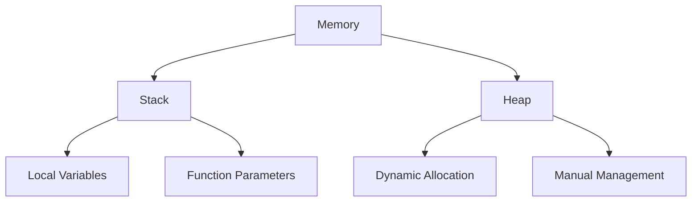
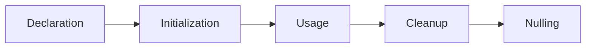

# Part 1: Introduction to Pointers

## Overview
Pointers are variables that store memory addresses of other variables. They are fundamental to C++ and enable powerful programming techniques like dynamic memory allocation, efficient parameter passing, and complex data structures.

## Memory and Addresses

### Basic Concepts
```cpp
int number = 42;      // Regular variable
int* ptr = &number;   // Pointer storing address of 'number'

cout << "Value: " << number << endl;        // 42
cout << "Address: " << &number << endl;     // 0x7fff5fbff8ac
cout << "Pointer: " << ptr << endl;         // 0x7fff5fbff8ac
cout << "Pointed value: " << *ptr << endl;  // 42
```

### Pointer Declaration
```cpp
int* ptr1;     // Pointer to integer
double* ptr2;  // Pointer to double
char* ptr3;    // Pointer to character
void* ptr4;    // Generic pointer (no specific type)

// Multiple pointers on one line
int *p1, *p2;  // Both are pointers
int* p3, p4;   // p3 is pointer, p4 is regular int
```

### Pointer Operations
```cpp
int value = 10;
int* ptr = &value;

*ptr = 20;     // Modify through pointer
value = 30;    // Direct modification
*ptr += 5;     // Arithmetic through pointer

cout << "Value: " << value << endl;    // 35
cout << "Pointed: " << *ptr << endl;   // 35
```

## Practice Exercise

Create a program demonstrating basic pointer operations:
1. Different types of pointers
2. Address operations
3. Value modifications
4. Pointer arithmetic

Solution:
```cpp
#include <iostream>
#include <string>
using namespace std;

void demonstratePointers() {
    // Basic pointer usage
    int number = 42;
    int* numPtr = &number;
    
    cout << "\nBasic Pointer Demo:" << endl;
    cout << string(30, '-') << endl;
    cout << "number value: " << number << endl;
    cout << "number address: " << &number << endl;
    cout << "numPtr value (address): " << numPtr << endl;
    cout << "numPtr dereferenced: " << *numPtr << endl;
    
    // Modifying through pointer
    *numPtr = 100;
    cout << "\nAfter modification:" << endl;
    cout << "number value: " << number << endl;
    cout << "numPtr dereferenced: " << *numPtr << endl;
}

void multiplePointers() {
    // Different data type pointers
    int i = 10;
    double d = 3.14;
    char c = 'A';
    string s = "Hello";
    
    int* pi = &i;
    double* pd = &d;
    char* pc = &c;
    string* ps = &s;
    
    cout << "\nMultiple Data Types:" << endl;
    cout << string(30, '-') << endl;
    cout << "Integer: " << *pi << endl;
    cout << "Double: " << *pd << endl;
    cout << "Character: " << *pc << endl;
    cout << "String: " << *ps << endl;
}

void pointerArithmetic() {
    // Array and pointer arithmetic
    int numbers[] = {10, 20, 30, 40, 50};
    int* ptr = numbers;  // Array decays to pointer
    
    cout << "\nPointer Arithmetic:" << endl;
    cout << string(30, '-') << endl;
    
    // Moving through array
    cout << "First element: " << *ptr << endl;
    ptr++;  // Move to next element
    cout << "Second element: " << *ptr << endl;
    ptr += 2;  // Skip two elements
    cout << "Fourth element: " << *ptr << endl;
    ptr--;  // Move back one element
    cout << "Third element: " << *ptr << endl;
}

void nullPointers() {
    // Null pointer demonstration
    int* ptr = nullptr;
    
    cout << "\nNull Pointer Demo:" << endl;
    cout << string(30, '-') << endl;
    cout << "Null pointer value: " << ptr << endl;
    
    // Safe null check
    if (ptr == nullptr) {
        cout << "Pointer is null" << endl;
    }
    
    // Allocate memory
    ptr = new int(42);
    cout << "After allocation: " << *ptr << endl;
    
    // Clean up
    delete ptr;
    ptr = nullptr;
}

void constPointers() {
    int value = 10;
    const int* ptr1 = &value;      // Can't modify value through pointer
    int* const ptr2 = &value;      // Can't modify pointer itself
    const int* const ptr3 = &value;// Can't modify either
    
    cout << "\nConst Pointers:" << endl;
    cout << string(30, '-') << endl;
    
    // ptr1 = &value;  // OK
    // *ptr1 = 20;     // Error
    
    // ptr2 = &value;  // Error
    *ptr2 = 20;      // OK
    
    // ptr3 = &value;  // Error
    // *ptr3 = 20;     // Error
    
    cout << "Value after modification: " << value << endl;
}

int main() {
    try {
        cout << "Pointer Basics Demonstration" << endl;
        cout << string(50, '=') << endl;
        
        demonstratePointers();
        multiplePointers();
        pointerArithmetic();
        nullPointers();
        constPointers();
        
        cout << "\nDemonstration completed successfully" << endl;
        cout << string(50, '=') << endl;
        
    } catch (const exception& e) {
        cout << "Error: " << e.what() << endl;
    }
    
    return 0;
}
```

## Memory Model

### Stack vs Heap


### Pointer Lifetime


## Best Practices

### Safety Guidelines
1. Initialize pointers
2. Check for null
3. Clean up properly
4. Use const when needed
5. Prefer references

### Common Patterns
1. Parameter passing
2. Array operations
3. Dynamic allocation
4. Data structures
5. Function pointers

### Memory Management
1. Proper allocation
2. Timely deallocation
3. Leak prevention
4. Scope management
5. Resource handling

## Common Mistakes to Avoid
1. Uninitialized pointers
2. Dangling pointers
3. Memory leaks
4. Invalid dereferencing
5. Type mismatches

## Next Steps
- Try the practice exercise
- Experiment with pointers
- Move on to [Part 2: Pointer Arithmetic]({{ site.baseurl }}/tutorials/module9/part2-arithmetic)
