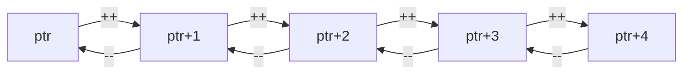

# Part 2: Pointer Arithmetic

## Overview
Pointer arithmetic allows you to perform mathematical operations on pointers to navigate through memory, particularly useful when working with arrays and data structures.

## Basic Arithmetic Operations

### Increment and Decrement
```cpp
int numbers[] = {10, 20, 30, 40, 50};
int* ptr = numbers;

cout << *ptr;     // 10 (first element)
ptr++;            // Move to next element
cout << *ptr;     // 20 (second element)
ptr--;            // Move back
cout << *ptr;     // 10 (first element again)
```

### Adding and Subtracting
```cpp
int* ptr = numbers;
ptr = ptr + 2;    // Skip two elements
cout << *ptr;     // 30 (third element)
ptr = ptr - 1;    // Move back one
cout << *ptr;     // 20 (second element)
```

### Array Indexing
```cpp
int* ptr = numbers;
cout << ptr[0];   // 10 (first element)
cout << ptr[2];   // 30 (third element)
cout << *(ptr+4); // 50 (fifth element)
```

## Practice Exercise

Create a program demonstrating pointer arithmetic operations:
1. Array traversal
2. Memory navigation
3. Array manipulation
4. Pointer comparisons

Solution:
```cpp
#include <iostream>
#include <string>
using namespace std;

void basicArithmetic() {
    int numbers[] = {10, 20, 30, 40, 50};
    int* ptr = numbers;
    
    cout << "\nBasic Arithmetic:" << endl;
    cout << string(30, '-') << endl;
    
    // Forward traversal
    cout << "Forward traversal:" << endl;
    for (int i = 0; i < 5; i++) {
        cout << "Element " << i << ": " << *ptr << endl;
        ptr++;
    }
    
    // Reset pointer
    ptr = numbers;
    
    // Backward traversal
    cout << "\nBackward traversal:" << endl;
    ptr = ptr + 4;  // Move to last element
    for (int i = 4; i >= 0; i--) {
        cout << "Element " << i << ": " << *ptr << endl;
        ptr--;
    }
}

void arrayManipulation() {
    int data[] = {1, 2, 3, 4, 5};
    int* start = data;
    int* end = data + 4;  // Point to last element
    
    cout << "\nArray Manipulation:" << endl;
    cout << string(30, '-') << endl;
    
    // Double each element
    cout << "Doubling elements:" << endl;
    while (start <= end) {
        *start *= 2;  // Double the value
        cout << *start << " ";
        start++;
    }
    cout << endl;
    
    // Reset pointer
    start = data;
    
    // Sum using pointer arithmetic
    int sum = 0;
    for (int* p = start; p <= end; p++) {
        sum += *p;
    }
    cout << "Sum of elements: " << sum << endl;
}

void pointerComparisons() {
    int values[] = {5, 10, 15, 20, 25};
    int* p1 = values;
    int* p2 = values + 4;  // Point to last element
    
    cout << "\nPointer Comparisons:" << endl;
    cout << string(30, '-') << endl;
    
    cout << "Memory addresses:" << endl;
    cout << "p1: " << static_cast<void*>(p1) << endl;
    cout << "p2: " << static_cast<void*>(p2) << endl;
    
    cout << "\nComparisons:" << endl;
    cout << "p1 < p2: " << (p1 < p2) << endl;
    cout << "Elements between: " << (p2 - p1) << endl;
    
    // Find middle element
    int* middle = p1 + (p2 - p1) / 2;
    cout << "Middle element: " << *middle << endl;
}

void arrayBounds() {
    const int SIZE = 5;
    int numbers[SIZE] = {1, 2, 3, 4, 5};
    int* ptr = numbers;
    
    cout << "\nArray Bounds:" << endl;
    cout << string(30, '-') << endl;
    
    // Safe traversal
    cout << "Safe traversal:" << endl;
    for (int i = 0; i < SIZE; i++) {
        cout << "Address: " << static_cast<void*>(ptr + i);
        cout << ", Value: " << *(ptr + i) << endl;
    }
    
    // Demonstrate bounds checking
    cout << "\nBounds checking:" << endl;
    int* start = numbers;
    int* end = numbers + SIZE - 1;
    
    cout << "First element: " << *start << endl;
    cout << "Last element: " << *end << endl;
    cout << "Array size: " << (end - start + 1) << endl;
}

void multiDimensional() {
    int matrix[3][4] = {
        {1, 2, 3, 4},
        {5, 6, 7, 8},
        {9, 10, 11, 12}
    };
    
    cout << "\nMulti-dimensional Arrays:" << endl;
    cout << string(30, '-') << endl;
    
    // Using pointer arithmetic
    int* ptr = &matrix[0][0];
    
    cout << "Matrix traversal:" << endl;
    for (int i = 0; i < 3; i++) {
        for (int j = 0; j < 4; j++) {
            cout << *(ptr + i * 4 + j) << " ";
        }
        cout << endl;
    }
    
    // Row pointers
    cout << "\nRow-wise access:" << endl;
    for (int i = 0; i < 3; i++) {
        int* row = matrix[i];
        for (int j = 0; j < 4; j++) {
            cout << row[j] << " ";
        }
        cout << endl;
    }
}

int main() {
    try {
        cout << "Pointer Arithmetic Demonstration" << endl;
        cout << string(50, '=') << endl;
        
        basicArithmetic();
        arrayManipulation();
        pointerComparisons();
        arrayBounds();
        multiDimensional();
        
        cout << "\nDemonstration completed successfully" << endl;
        cout << string(50, '=') << endl;
        
    } catch (const exception& e) {
        cout << "Error: " << e.what() << endl;
    }
    
    return 0;
}
```

## Memory Layout

### Array in Memory
```
+---+---+---+---+---+
| 10| 20| 30| 40| 50|
+---+---+---+---+---+
  ^   ^   ^   ^   ^
  |   |   |   |   |
ptr ptr+1 +2  +3  +4
```

### Pointer Movement


## Best Practices

### Safety Guidelines
1. Check array bounds
2. Validate pointers
3. Use size tracking
4. Reset after use
5. Consider alternatives

### Common Patterns
1. Array traversal
2. Memory blocks
3. Data structures
4. String operations
5. Buffer management

### Performance Tips
1. Minimize arithmetic
2. Use array indexing
3. Cache awareness
4. Bounds checking
5. Memory alignment

## Common Mistakes to Avoid
1. Out-of-bounds access
2. Invalid arithmetic
3. Uninitialized pointers
4. Type mismatches
5. Memory leaks

## Next Steps
- Try the practice exercise
- Experiment with arrays
- Move on to [Part 3: Dynamic Memory Allocation]({{ site.baseurl }}/tutorials/module9/part3-dynamic)
