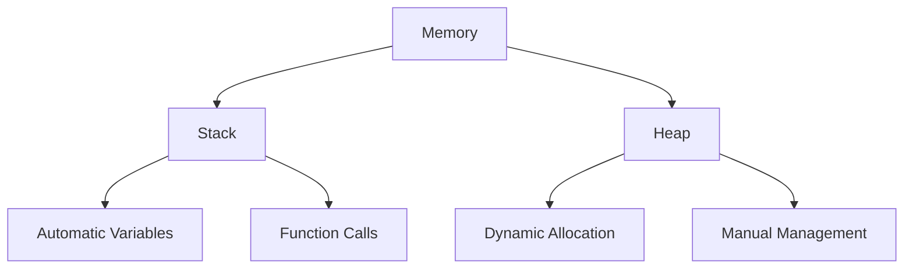
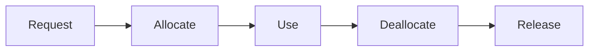

# Part 3: Dynamic Memory Allocation

## Overview
Dynamic memory allocation allows programs to request memory at runtime. This enables flexible memory management and the creation of data structures that can grow or shrink as needed.

## Memory Management

### new and delete Operators
```cpp
// Single object allocation
int* ptr = new int;       // Allocate uninitialized int
int* ptr2 = new int(42);  // Allocate and initialize

// Cleanup
delete ptr;
delete ptr2;
ptr = nullptr;
ptr2 = nullptr;
```

### Array Allocation
```cpp
// Array allocation
int* arr = new int[5];        // Array of 5 ints
int* arr2 = new int[5]{1,2,3,4,5};  // Initialized array

// Array cleanup
delete[] arr;
delete[] arr2;
arr = nullptr;
arr2 = nullptr;
```

### Object Allocation
```cpp
class MyClass {
    // Class definition...
};

MyClass* obj = new MyClass();     // Single object
MyClass* objs = new MyClass[10];  // Array of objects

delete obj;       // Single object cleanup
delete[] objs;    // Array cleanup
```

## Practice Exercise

Create a program demonstrating dynamic memory management:
1. Basic allocation/deallocation
2. Array handling
3. Object management
4. Memory safety

Solution:
```cpp
#include <iostream>
#include <string>
using namespace std;

class Resource {
private:
    string name;
    int* data;
    size_t size;
    
public:
    Resource(string n, size_t s) 
        : name(n), size(s) {
        cout << "Creating resource: " << name << endl;
        data = new int[size];
        
        // Initialize data
        for (size_t i = 0; i < size; i++) {
            data[i] = i + 1;
        }
    }
    
    ~Resource() {
        cout << "Destroying resource: " << name << endl;
        delete[] data;
    }
    
    void display() const {
        cout << "Resource " << name << " data: ";
        for (size_t i = 0; i < size; i++) {
            cout << data[i] << " ";
        }
        cout << endl;
    }
    
    void modify(size_t index, int value) {
        if (index < size) {
            data[index] = value;
        }
    }
};

void basicAllocation() {
    cout << "\nBasic Allocation:" << endl;
    cout << string(30, '-') << endl;
    
    // Single value allocation
    int* number = new int(42);
    cout << "Allocated value: " << *number << endl;
    delete number;
    
    // Array allocation
    const size_t size = 5;
    double* numbers = new double[size]{1.1, 2.2, 3.3, 4.4, 5.5};
    
    cout << "Allocated array: ";
    for (size_t i = 0; i < size; i++) {
        cout << numbers[i] << " ";
    }
    cout << endl;
    
    delete[] numbers;
}

void dynamicArrays() {
    cout << "\nDynamic Arrays:" << endl;
    cout << string(30, '-') << endl;
    
    // Get size at runtime
    size_t size;
    cout << "Enter array size: ";
    cin >> size;
    
    // Allocate array
    int* array = new int[size];
    
    // Initialize array
    cout << "Initializing array..." << endl;
    for (size_t i = 0; i < size; i++) {
        array[i] = i * 2;
    }
    
    // Display array
    cout << "Array contents: ";
    for (size_t i = 0; i < size; i++) {
        cout << array[i] << " ";
    }
    cout << endl;
    
    // Cleanup
    delete[] array;
}

void objectAllocation() {
    cout << "\nObject Allocation:" << endl;
    cout << string(30, '-') << endl;
    
    // Single object
    Resource* res1 = new Resource("Single", 3);
    res1->display();
    res1->modify(1, 10);
    res1->display();
    delete res1;
    
    // Array of objects
    const size_t count = 2;
    Resource** resources = new Resource*[count];
    
    // Create objects
    for (size_t i = 0; i < count; i++) {
        resources[i] = new Resource("Array" + to_string(i), 2);
    }
    
    // Use objects
    for (size_t i = 0; i < count; i++) {
        resources[i]->display();
    }
    
    // Cleanup
    for (size_t i = 0; i < count; i++) {
        delete resources[i];
    }
    delete[] resources;
}

void memoryLeakPrevention() {
    cout << "\nMemory Leak Prevention:" << endl;
    cout << string(30, '-') << endl;
    
    try {
        // Allocate resources
        int* data = new int[1000];
        Resource* res = new Resource("Test", 5);
        
        // Simulate error
        throw runtime_error("Simulated error");
        
        // This cleanup never happens!
        delete[] data;
        delete res;
        
    } catch (const exception& e) {
        cout << "Error caught: " << e.what() << endl;
        // Memory leak! Resources not freed
    }
    
    // Proper way with RAII
    try {
        // Resources automatically cleaned up when going out of scope
        Resource res("RAII", 3);
        res.display();
        
        throw runtime_error("Another error");
        
    } catch (const exception& e) {
        cout << "Error caught: " << e.what() << endl;
        // No memory leak - destructor automatically called
    }
}

int main() {
    try {
        cout << "Dynamic Memory Management Demonstration" << endl;
        cout << string(50, '=') << endl;
        
        basicAllocation();
        dynamicArrays();
        objectAllocation();
        memoryLeakPrevention();
        
        cout << "\nDemonstration completed successfully" << endl;
        cout << string(50, '=') << endl;
        
    } catch (const exception& e) {
        cout << "Error: " << e.what() << endl;
    }
    
    return 0;
}
```

## Memory Model

### Heap vs Stack


### Memory Lifecycle


## Best Practices

### Allocation Guidelines
1. Check allocation success
2. Initialize memory
3. Track allocations
4. Clean up properly
5. Use RAII pattern

### Memory Safety
1. Null pointer checks
2. Bounds checking
3. Exception safety
4. Resource tracking
5. Smart pointers

### Performance Tips
1. Minimize allocations
2. Batch operations
3. Reuse memory
4. Size alignment
5. Memory pools

## Common Mistakes to Avoid
1. Memory leaks
2. Double deletion
3. Dangling pointers
4. Buffer overflows
5. Array/scalar mismatch

## Next Steps
- Try the practice exercise
- Experiment with memory management
- Move on to [Part 4: Memory Leaks]({{ site.baseurl }}/tutorials/module9/part4-leaks)
