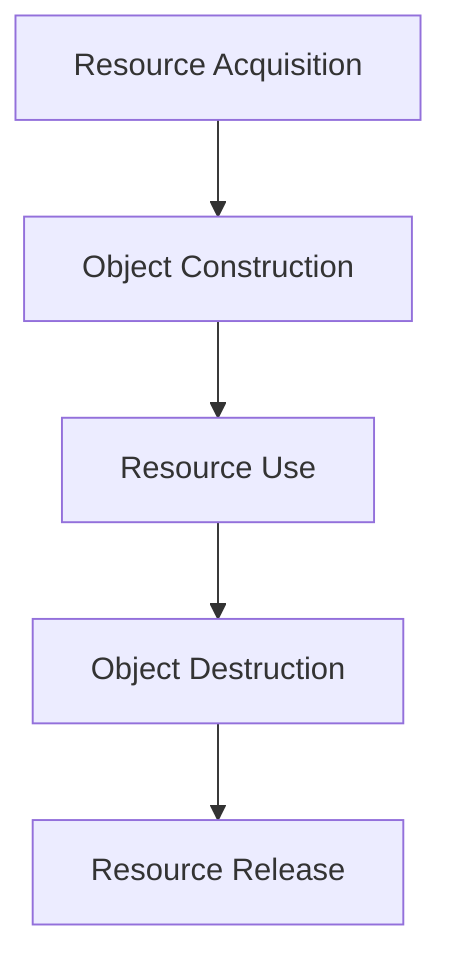
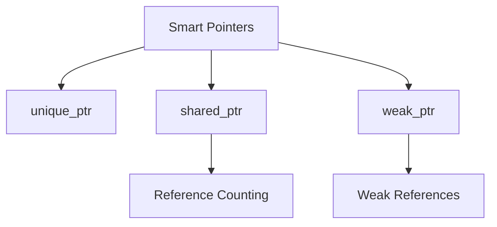

# Part 4: Memory Leaks

## Overview
Memory leaks occur when dynamically allocated memory is not properly deallocated. This can lead to resource exhaustion and program instability. Understanding how to prevent and detect memory leaks is crucial for writing reliable C++ programs.

## Common Memory Leaks

### Lost Pointers
```cpp
void lostPointer() {
    int* ptr = new int(42);
    ptr = nullptr;     // Original memory lost!
    // delete ptr;     // Can't free memory anymore
}
```

### Missing Delete
```cpp
void missingDelete() {
    int* arr = new int[100];
    // Function returns without delete
    // Memory leak!
}
```

### Exception Leaks
```cpp
void exceptionLeak() {
    int* data = new int[1000];
    throw runtime_error("Error");
    // Never reaches cleanup
    delete[] data;
}
```

## Practice Exercise

Create a program demonstrating memory leak detection and prevention:
1. Common leak scenarios
2. Proper cleanup practices
3. RAII pattern
4. Smart pointer usage

Solution:
```cpp
#include <iostream>
#include <string>
#include <memory>
#include <vector>
using namespace std;

class Resource {
private:
    string name;
    int* data;
    size_t size;
    
public:
    Resource(string n, size_t s) 
        : name(n), size(s) {
        cout << "Creating resource: " << name << endl;
        data = new int[size];
        
        // Initialize data
        for (size_t i = 0; i < size; i++) {
            data[i] = i + 1;
        }
    }
    
    ~Resource() {
        cout << "Destroying resource: " << name << endl;
        delete[] data;
    }
    
    void display() const {
        cout << "Resource " << name << " data: ";
        for (size_t i = 0; i < size; i++) {
            cout << data[i] << " ";
        }
        cout << endl;
    }
};

void demonstrateLeaks() {
    cout << "\nDemonstrating Memory Leaks:" << endl;
    cout << string(30, '-') << endl;
    
    // Lost pointer
    cout << "Lost pointer leak:" << endl;
    int* ptr1 = new int(42);
    ptr1 = new int(100);  // Original memory leaked
    delete ptr1;  // Only frees second allocation
    
    // Missing delete
    cout << "\nMissing delete leak:" << endl;
    int* ptr2 = new int[5];
    // No delete - memory leaked
    
    // Exception leak
    cout << "\nException leak:" << endl;
    try {
        int* ptr3 = new int[1000];
        throw runtime_error("Error");
        delete[] ptr3;  // Never reached
    } catch (const exception& e) {
        cout << "Error caught: " << e.what() << endl;
        // Memory leaked
    }
}

void demonstrateRAII() {
    cout << "\nDemonstrating RAII:" << endl;
    cout << string(30, '-') << endl;
    
    // Automatic cleanup
    {
        Resource res("RAII Example", 3);
        // Resource automatically cleaned up when scope ends
    }
    
    // Exception safety
    try {
        Resource res("Exception Safe", 5);
        throw runtime_error("Error");
    } catch (const exception& e) {
        cout << "Error caught: " << e.what() << endl;
        // Resource automatically cleaned up
    }
}

void demonstrateSmartPointers() {
    cout << "\nDemonstrating Smart Pointers:" << endl;
    cout << string(30, '-') << endl;
    
    // unique_ptr
    cout << "unique_ptr example:" << endl;
    {
        unique_ptr<Resource> res1(new Resource("Unique", 3));
        res1->display();
        // Automatically deleted when scope ends
    }
    
    // shared_ptr
    cout << "\nshared_ptr example:" << endl;
    {
        shared_ptr<Resource> res2(new Resource("Shared1", 2));
        {
            shared_ptr<Resource> res3 = res2;  // Share ownership
            cout << "Reference count: " << res2.use_count() << endl;
        }
        cout << "Reference count: " << res2.use_count() << endl;
        // Deleted when last reference is gone
    }
    
    // weak_ptr
    cout << "\nweak_ptr example:" << endl;
    {
        shared_ptr<Resource> shared(new Resource("SharedWeak", 2));
        weak_ptr<Resource> weak = shared;
        
        if (auto res = weak.lock()) {
            cout << "Resource still exists" << endl;
            res->display();
        }
        
        shared.reset();  // Release shared_ptr
        
        if (weak.expired()) {
            cout << "Resource no longer exists" << endl;
        }
    }
}

class ResourceManager {
private:
    vector<unique_ptr<Resource>> resources;
    
public:
    void addResource(string name, size_t size) {
        resources.push_back(make_unique<Resource>(name, size));
    }
    
    void displayAll() const {
        cout << "\nAll resources:" << endl;
        for (const auto& res : resources) {
            res->display();
        }
    }
    
    // No need for manual cleanup - unique_ptr handles it
};

int main() {
    try {
        cout << "Memory Leak Prevention Demonstration" << endl;
        cout << string(50, '=') << endl;
        
        // Bad practices - showing leaks
        demonstrateLeaks();
        
        // Good practices
        demonstrateRAII();
        demonstrateSmartPointers();
        
        // Resource management
        cout << "\nResource Management:" << endl;
        cout << string(30, '-') << endl;
        
        ResourceManager manager;
        manager.addResource("First", 2);
        manager.addResource("Second", 3);
        manager.displayAll();
        
        cout << "\nDemonstration completed successfully" << endl;
        cout << string(50, '=') << endl;
        
    } catch (const exception& e) {
        cout << "Error: " << e.what() << endl;
    }
    
    return 0;
}
```

## Memory Management Patterns

### RAII Pattern


### Smart Pointer Hierarchy


## Best Practices

### Memory Management
1. Use RAII
2. Prefer smart pointers
3. Clear ownership
4. Exception safety
5. Systematic cleanup

### Smart Pointer Usage
1. unique_ptr for ownership
2. shared_ptr for sharing
3. weak_ptr for cycles
4. make_unique/shared
5. Custom deleters

### Leak Prevention
1. Consistent cleanup
2. Scope management
3. Exception handling
4. Resource tracking
5. Memory monitoring

## Common Mistakes to Avoid
1. Raw pointer ownership
2. Manual deletion
3. Circular references
4. Exception leaks
5. Resource tracking

## Next Steps
- Try the practice exercise
- Experiment with smart pointers
- Move on to [Part 5: Pointers to Objects]({{ site.baseurl }}/tutorials/module9/part5-object-pointers)
