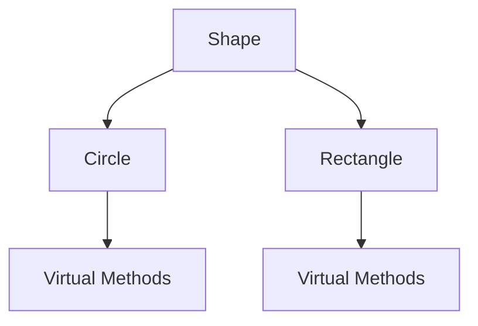
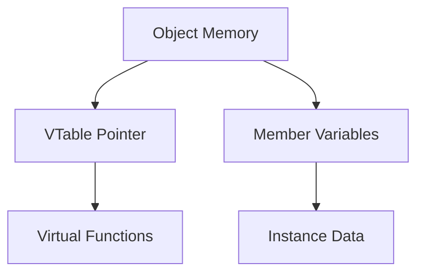

# Part 5: Pointers to Objects

## Overview
Pointers to objects are essential in C++ for dynamic object creation, polymorphism, and efficient memory management. Understanding how to work with object pointers is crucial for advanced C++ programming.

## Object Pointer Basics

### Declaration and Initialization
```cpp
class MyClass {
    // Class definition...
};

MyClass obj;              // Regular object
MyClass* ptr = &obj;      // Pointer to object
MyClass* dynPtr = new MyClass();  // Dynamic object
```

### Member Access
```cpp
MyClass obj;
MyClass* ptr = &obj;

obj.method();    // Direct member access
ptr->method();   // Arrow operator
(*ptr).method(); // Dereference and dot operator
```

### Dynamic Objects
```cpp
// Single object
MyClass* obj = new MyClass();
obj->method();
delete obj;

// Array of objects
MyClass* arr = new MyClass[5];
arr[0].method();
delete[] arr;
```

## Practice Exercise

Create a program demonstrating object pointer usage:
1. Basic object pointers
2. Dynamic object creation
3. Member access
4. Inheritance and polymorphism

Solution:
```cpp
#include <iostream>
#include <string>
#include <vector>
using namespace std;

// Base class
class Shape {
protected:
    string name;
    double area;
    
public:
    Shape(string n) : name(n), area(0) {
        cout << "Creating shape: " << name << endl;
    }
    
    virtual ~Shape() {
        cout << "Destroying shape: " << name << endl;
    }
    
    virtual void calculate() = 0;
    
    virtual void display() const {
        cout << "Shape: " << name << endl;
        cout << "Area: " << area << endl;
    }
};

// Derived classes
class Circle : public Shape {
private:
    double radius;
    
public:
    Circle(string n, double r) 
        : Shape(n), radius(r) {
        calculate();
    }
    
    void calculate() override {
        area = 3.14159 * radius * radius;
    }
    
    void display() const override {
        Shape::display();
        cout << "Radius: " << radius << endl;
    }
};

class Rectangle : public Shape {
private:
    double width;
    double height;
    
public:
    Rectangle(string n, double w, double h)
        : Shape(n), width(w), height(h) {
        calculate();
    }
    
    void calculate() override {
        area = width * height;
    }
    
    void display() const override {
        Shape::display();
        cout << "Width: " << width << endl;
        cout << "Height: " << height << endl;
    }
};

void demonstrateBasicPointers() {
    cout << "\nBasic Object Pointers:" << endl;
    cout << string(30, '-') << endl;
    
    // Stack object with pointer
    Circle circle("Stack Circle", 5);
    Circle* circlePtr = &circle;
    
    cout << "Direct access:" << endl;
    circle.display();
    
    cout << "\nPointer access:" << endl;
    circlePtr->display();
    
    // Different access methods
    cout << "\nDifferent access methods:" << endl;
    circlePtr->display();     // Arrow operator
    (*circlePtr).display();   // Dereference and dot
}

void demonstrateDynamicObjects() {
    cout << "\nDynamic Objects:" << endl;
    cout << string(30, '-') << endl;
    
    // Single dynamic object
    Shape* shape1 = new Circle("Dynamic Circle", 3);
    shape1->display();
    delete shape1;
    
    // Array of objects
    Rectangle* rectangles = new Rectangle[2]{
        Rectangle("Rect1", 2, 3),
        Rectangle("Rect2", 4, 5)
    };
    
    cout << "\nRectangle array:" << endl;
    for (int i = 0; i < 2; i++) {
        rectangles[i].display();
        cout << endl;
    }
    
    delete[] rectangles;
}

void demonstratePolymorphism() {
    cout << "\nPolymorphism with Pointers:" << endl;
    cout << string(30, '-') << endl;
    
    // Array of base class pointers
    vector<Shape*> shapes;
    
    // Add different shapes
    shapes.push_back(new Circle("Poly Circle", 4));
    shapes.push_back(new Rectangle("Poly Rectangle", 3, 6));
    
    // Polymorphic calls
    cout << "Displaying all shapes:" << endl;
    for (Shape* shape : shapes) {
        shape->display();
        cout << endl;
    }
    
    // Cleanup
    for (Shape* shape : shapes) {
        delete shape;
    }
    shapes.clear();
}

class ShapeManager {
private:
    vector<Shape*> shapes;
    
public:
    void addShape(Shape* shape) {
        shapes.push_back(shape);
    }
    
    void displayAll() const {
        cout << "\nAll Shapes:" << endl;
        for (const Shape* shape : shapes) {
            shape->display();
            cout << endl;
        }
    }
    
    ~ShapeManager() {
        for (Shape* shape : shapes) {
            delete shape;
        }
        shapes.clear();
    }
};

int main() {
    try {
        cout << "Object Pointer Demonstration" << endl;
        cout << string(50, '=') << endl;
        
        demonstrateBasicPointers();
        demonstrateDynamicObjects();
        demonstratePolymorphism();
        
        // Shape management
        cout << "\nShape Management:" << endl;
        cout << string(30, '-') << endl;
        
        ShapeManager manager;
        manager.addShape(new Circle("Managed Circle", 2));
        manager.addShape(new Rectangle("Managed Rectangle", 3, 4));
        manager.displayAll();
        
        cout << "\nDemonstration completed successfully" << endl;
        cout << string(50, '=') << endl;
        
    } catch (const exception& e) {
        cout << "Error: " << e.what() << endl;
    }
    
    return 0;
}
```

## Object Relationships

### Inheritance Hierarchy


### Memory Layout


## Best Practices

### Object Management
1. Clear ownership
2. Proper cleanup
3. Virtual destructors
4. Smart pointers
5. Resource handling

### Pointer Safety
1. Null checks
2. Type safety
3. Memory management
4. Exception handling
5. Scope control

### Design Patterns
1. Factory pattern
2. Observer pattern
3. Strategy pattern
4. Command pattern
5. Composite pattern

## Common Mistakes to Avoid
1. Missing virtual destructors
2. Memory leaks
3. Dangling pointers
4. Type confusion
5. Ownership issues

## Next Steps
- Try the practice exercise
- Experiment with inheritance
- Move on to [Part 6: Function Pointers]({{ site.baseurl }}/tutorials/module9/part6-function-pointers)
