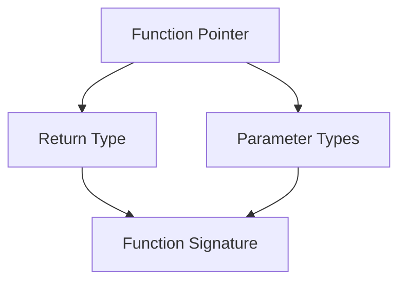
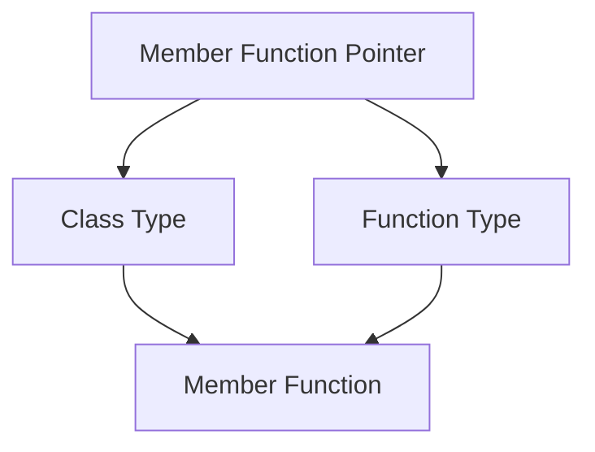

# Part 6: Function Pointers

## Overview
Function pointers allow you to store and pass functions as variables. They are essential for implementing callbacks, plugins, and dynamic behavior in C++ programs.

## Function Pointer Basics

### Declaration and Assignment
```cpp
// Function declaration
int add(int a, int b) { return a + b; }

// Function pointer declaration
int (*funcPtr)(int, int);

// Assignment
funcPtr = add;  // or &add
```

### Using Function Pointers
```cpp
int result1 = funcPtr(5, 3);     // Direct call
int result2 = (*funcPtr)(5, 3);  // Dereference call
```

### Array of Function Pointers
```cpp
int (*operations[])(int, int) = {
    add,
    subtract,
    multiply
};

int result = operations[0](5, 3);  // Calls add(5, 3)
```

## Practice Exercise

Create a program demonstrating function pointer usage:
1. Basic function pointers
2. Callback functions
3. Function pointer arrays
4. Member function pointers

Solution:
```cpp
#include <iostream>
#include <string>
#include <vector>
#include <algorithm>
using namespace std;

// Basic arithmetic functions
int add(int a, int b) { return a + b; }
int subtract(int a, int b) { return a - b; }
int multiply(int a, int b) { return a * b; }
int divide(int a, int b) { return b != 0 ? a / b : 0; }

// Function pointer type definition
typedef int (*Operation)(int, int);

class Calculator {
private:
    vector<pair<string, Operation>> operations;
    
public:
    Calculator() {
        // Register operations
        registerOperation("Add", add);
        registerOperation("Subtract", subtract);
        registerOperation("Multiply", multiply);
        registerOperation("Divide", divide);
    }
    
    void registerOperation(string name, Operation op) {
        operations.push_back(make_pair(name, op));
    }
    
    void performOperation(string name, int a, int b) {
        auto it = find_if(operations.begin(), operations.end(),
            [name](const auto& pair) { return pair.first == name; });
            
        if (it != operations.end()) {
            int result = it->second(a, b);
            cout << name << "(" << a << ", " << b << ") = " << result << endl;
        } else {
            cout << "Operation not found: " << name << endl;
        }
    }
    
    void listOperations() const {
        cout << "Available operations:" << endl;
        for (const auto& op : operations) {
            cout << "- " << op.first << endl;
        }
    }
};

// Callback example
void processNumbers(vector<int>& numbers, Operation op) {
    cout << "Processing numbers: ";
    for (size_t i = 0; i < numbers.size() - 1; i++) {
        numbers[i] = op(numbers[i], numbers[i + 1]);
        cout << numbers[i] << " ";
    }
    cout << endl;
}

void demonstrateBasicPointers() {
    cout << "\nBasic Function Pointers:" << endl;
    cout << string(30, '-') << endl;
    
    // Direct function calls
    cout << "Direct calls:" << endl;
    cout << "add(5, 3) = " << add(5, 3) << endl;
    cout << "subtract(5, 3) = " << subtract(5, 3) << endl;
    
    // Function pointer usage
    Operation op1 = add;
    Operation op2 = &subtract;
    
    cout << "\nFunction pointer calls:" << endl;
    cout << "op1(5, 3) = " << op1(5, 3) << endl;
    cout << "op2(5, 3) = " << op2(5, 3) << endl;
    cout << "(*op1)(5, 3) = " << (*op1)(5, 3) << endl;
}

void demonstrateCallbacks() {
    cout << "\nCallback Functions:" << endl;
    cout << string(30, '-') << endl;
    
    vector<int> numbers = {1, 2, 3, 4, 5};
    
    cout << "Adding adjacent numbers:" << endl;
    processNumbers(numbers, add);
    
    numbers = {10, 5, 3, 2, 1};
    cout << "\nSubtracting adjacent numbers:" << endl;
    processNumbers(numbers, subtract);
}

void demonstrateFunctionArray() {
    cout << "\nFunction Pointer Array:" << endl;
    cout << string(30, '-') << endl;
    
    // Array of function pointers
    Operation operations[] = {add, subtract, multiply, divide};
    string opNames[] = {"Addition", "Subtraction", "Multiplication", "Division"};
    
    int a = 10, b = 5;
    for (size_t i = 0; i < 4; i++) {
        cout << opNames[i] << ": " << operations[i](a, b) << endl;
    }
}

class MathProcessor {
private:
    int value;
    
public:
    MathProcessor(int v) : value(v) {}
    
    // Member functions
    void add(int x) { value += x; }
    void subtract(int x) { value -= x; }
    void multiply(int x) { value *= x; }
    void divide(int x) { if (x != 0) value /= x; }
    
    int getValue() const { return value; }
};

void demonstrateMemberPointers() {
    cout << "\nMember Function Pointers:" << endl;
    cout << string(30, '-') << endl;
    
    // Member function pointer type
    typedef void (MathProcessor::*MemberOp)(int);
    
    // Array of member function pointers
    MemberOp operations[] = {
        &MathProcessor::add,
        &MathProcessor::subtract,
        &MathProcessor::multiply,
        &MathProcessor::divide
    };
    
    string opNames[] = {"Adding", "Subtracting", "Multiplying", "Dividing"};
    
    MathProcessor proc(10);
    cout << "Initial value: " << proc.getValue() << endl;
    
    int operand = 5;
    for (size_t i = 0; i < 4; i++) {
        cout << opNames[i] << " " << operand << "..." << endl;
        (proc.*operations[i])(operand);
        cout << "Result: " << proc.getValue() << endl;
    }
}

int main() {
    try {
        cout << "Function Pointer Demonstration" << endl;
        cout << string(50, '=') << endl;
        
        demonstrateBasicPointers();
        demonstrateCallbacks();
        demonstrateFunctionArray();
        demonstrateMemberPointers();
        
        // Calculator example
        cout << "\nCalculator Example:" << endl;
        cout << string(30, '-') << endl;
        
        Calculator calc;
        calc.listOperations();
        
        cout << "\nPerforming calculations:" << endl;
        calc.performOperation("Add", 10, 5);
        calc.performOperation("Multiply", 6, 4);
        calc.performOperation("Divide", 15, 3);
        
        cout << "\nDemonstration completed successfully" << endl;
        cout << string(50, '=') << endl;
        
    } catch (const exception& e) {
        cout << "Error: " << e.what() << endl;
    }
    
    return 0;
}
```

## Function Pointer Types

### Basic Function Pointer


### Member Function Pointer


## Best Practices

### Function Pointer Usage
1. Type definitions
2. Null checks
3. Const correctness
4. Error handling
5. Documentation

### Callback Design
1. Clear interfaces
2. Error handling
3. Context passing
4. Lifetime management
5. Thread safety

### Member Functions
1. Access control
2. Const methods
3. Virtual functions
4. Inheritance
5. Scope resolution

## Common Mistakes to Avoid
1. Type mismatches
2. Invalid pointers
3. Memory leaks
4. Callback cycles
5. Thread safety issues

## Next Steps
- Try the practice exercise
- Experiment with callbacks
- Move on to [Part 7: Arrays and Pointers]({{ site.baseurl }}/tutorials/module9/part7-arrays)
