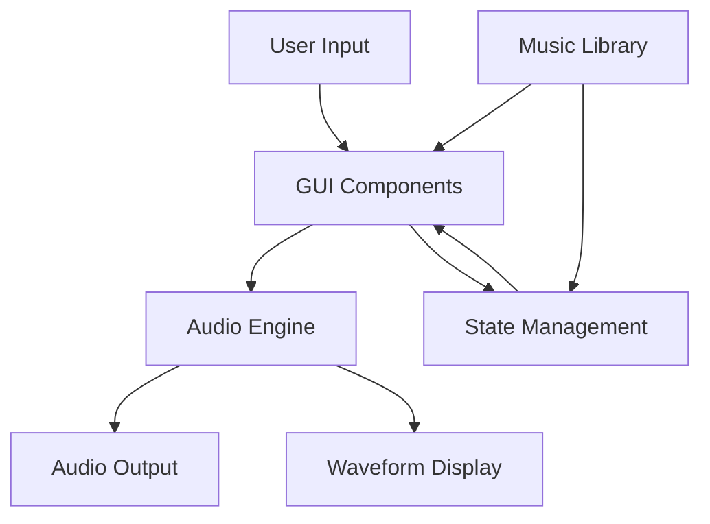

# System Patterns

## Tutorial Architecture

### Organization Pattern
1. Module Structure
   - Progressive topic introduction
   - Concept building blocks
   - Practical examples
   - Exercise implementations

2. Code Organization
   - Clear examples for each concept
   - Helper code templates
   - Exercise solutions
   - Implementation guidelines

### Learning Patterns
1. Concept Introduction
   - Theory explanation
   - Code examples
   - Practice exercises
   - Implementation tasks

2. Progression Strategy
   - Basic to advanced concepts
   - Building on previous knowledge
   - Practical applications
   - Real-world examples

## MerkelRex Architecture

### Core Classes
1. WeatherRecord
   - Represents temperature records
   - Encapsulates data (timestamp, temperature, location)
   - Implements data validation

2. CSVReader
   - Handles weather data file parsing
   - Implements error handling
   - Converts raw data to objects

3. Candlestick
   - Represents OHLC data
   - Computes temperature statistics
   - Manages time frame aggregation

4. TextPlot
   - Generates text-based plots
   - Visualizes candlestick data
   - Implements ASCII graphics

5. DataFilter
   - Filters data by date/location
   - Implements search criteria
   - Manages data selection

6. WeatherPredictor
   - Implements prediction models
   - Calculates future temperatures
   - Manages prediction accuracy

7. MainApp
   - Controls application flow
   - Manages user interaction
   - Coordinates system components

### Design Patterns
1. **Model-View-Controller (MVC)**
   - Model: WeatherRecord, Candlestick, DataFilter
   - View: Console output, TextPlot
   - Controller: MainApp, WeatherPredictor

2. **Factory Pattern**
   - WeatherRecord creation
   - Candlestick computation
   - Data object instantiation

3. **Strategy Pattern**
   - Prediction algorithms
   - Data filtering strategies
   - Visualization methods

## Project Architecture

### Organization Pattern
1. Documentation Structure
   - Assignment briefs
   - Implementation guides
   - Code examples
   - Best practices

2. Boilerplate Organization
   - Multiple implementation approaches
   - Commented code templates
   - Design patterns examples
   - Extension points

### Development Patterns
1. Code Templates
   - Basic structure templates
   - Implementation variations
   - Extension examples
   - Documentation guidelines

2. Documentation Strategy
   - Clear requirements
   - Implementation guidance
   - Anti-plagiarism measures
   - Best practices

## OtoDecks Architecture

### Core Components
1. MainComponent
   - Application entry point
   - UI layout management
   - Component coordination

2. DeckGUI
   - Individual deck interface
   - Playback controls
   - Waveform display
    - Custom graphics

3. AudioPlayer
   - Audio file handling
   - Playback management
   - Format support

4. WaveformDisplay
   - Audio visualization
   - Real-time updates
   - User interaction

5. MusicLibrary
    - Manages audio files
    - Search functionality
    - Persistent storage

### Design Patterns
1. **Component Pattern (JUCE)**
   - Hierarchical UI structure
   - Event propagation
   - Resource management

2. **Observer Pattern**
   - Audio state updates
   - UI refresh triggers
   - Component synchronization

3. **Command Pattern**
   - Audio transport controls
   - User interface actions
   - State management

### Data Flow

## Common Patterns

### Error Handling
- Exception hierarchies
- Validation chains
- User feedback systems

### Resource Management
- RAII principles
- Smart pointers
- Resource pools

### Testing Strategy
- Unit tests
- Integration tests
- User acceptance criteria
